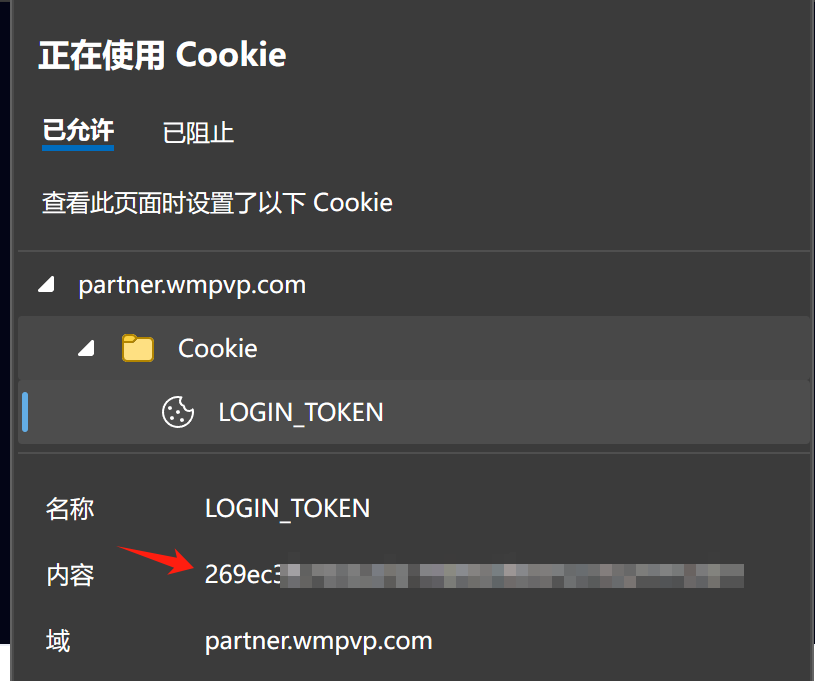

# Usage
修改config.ini文件中的userid,access_token与demoPath路径，然后运行~
现已支持下载多用户的demo，详情参考config.ini.example。

Edit the userid ,access_token and demoPath in config.ini, then run it~
## Get userid and access_token
userid 为你的steam64位id。如：http://steamcommunity.com/profiles/76561198159976336 
若设置了steam URL，在网页 https://steamid.io/lookup/ 中粘贴自己的steam个人资料首页可获取。如76561198159976336 

userid is your Steam64 id. Such as http://steamcommunity.com/profiles/76561198159976336 
If you set steam URL, you can access https://steamid.io/lookup/ to get your steam64 id.

access_token is the cookie in https://partner.wmpvp.com/#/login 

# 关于如何获取完美平台中其他玩家的userid或Steam64 id
普通玩家可通过游戏内或demo查看时点击头像并查看个人资料查找，职业玩家可从liquidpedia.net或其他网站查找Steam61 id。

