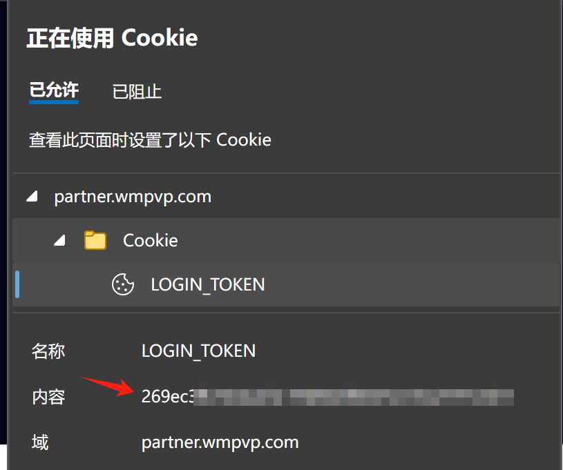

# PWA Demo Downloader

完美对战平台 (Perfect World Arena) CSGO demo 自动下载工具，支持多用户。
Automatically downloads CSGO demos from the Perfect World Arena platform.

## 工作原理 / Background

完美客户端 `>= 1.0.26051411` 起，demo 下载 URL 的签名被搬进了反作弊 DLL `PvpAlive.dll`，并用 VMProtect 虚拟化保护，无法纯 Python 复现。本工具通过 `ctypes` 调用 `PvpAlive.dll` 的 `swapData` 导出函数完成签名。该 DLL 是 32 位 PE，所以签名桥接脚本必须用 32 位 Python 运行。

主进程跑你自己的 Python (3.10+，任意位宽)，签名时 spawn `python32/python.exe sign_helper.py`。

## 一次性准备 / Setup

1. **完美客户端**：默认安装路径 `D:\ProgramFile\game\perfectworld\`。如果你装在别处，请改 `sign_helper.py` 里的 `DLL_PATH`。
2. **32 位 Python**：从 https://www.python.org/ftp/python/3.12.7/python-3.12.7-embed-win32.zip 下载 embeddable 包，解压到项目根目录下，使 `python32/python.exe` 存在。**必须是 `win32`，不能是 `amd64`**。
3. **主环境依赖**：
   ```
   pip install requests cryptography
   ```
4. **配置**：复制 `config.ini.example` 为 `config.ini`，填入字段。多用户加多个 `[section]` 即可。

## 运行 / Run

```
python main.py
```

程序会拉取该账号最近 20 场 demo URL，跳过已下载的，新文件下载完后自动解压。服务器对已过期/不存在的 demo 返回 JSON 错误而非 302，会被打印 `Demo Url out of date`。

## 获取 userid 与 access_token

- **userid**：Steam64 id，例如 `76561198159976336`。Steam 个人资料 URL 末尾即是；若设了自定义 URL，可在 https://steamid.io/lookup/ 反查。
- **access_token**：浏览器登录 https://partner.wmpvp.com/#/login 后从 cookie 里取。



## 查找其他玩家的 Steam64 id

普通玩家：游戏内或 demo 查看页点击头像 → 查看个人资料。
职业选手：liquipedia.net 等站点。
